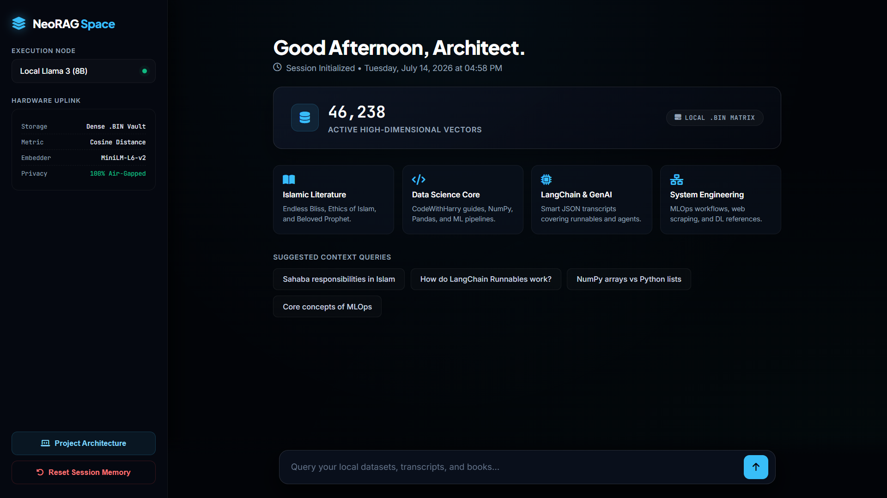
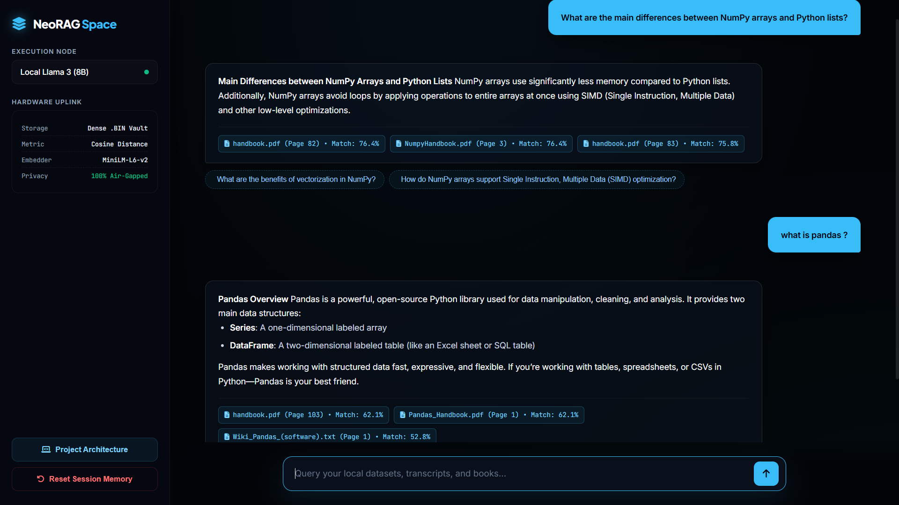
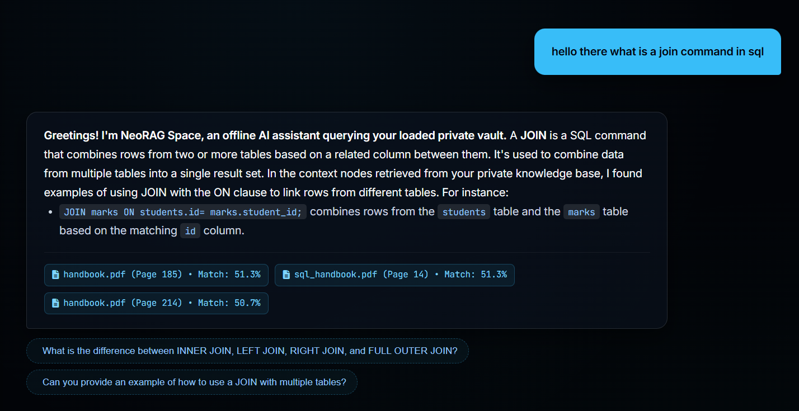
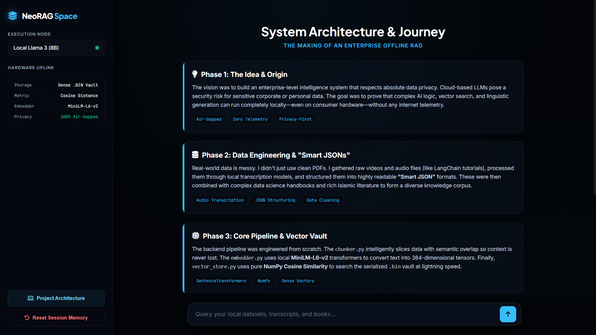

# 🌌 NeoRAG Space — Enterprise Local Private Knowledge Core

NeoRAG Space is a production-grade, 100% offline, local Retrieval-Augmented Generation (RAG) platform engineered to parse, split, vectorize, and search deep technical text repositories. Architected to eliminate data leaks to public clouds, the framework hosts high-dimensional vector spaces and multi-turn linguistic models entirely within a sandboxed, air-gapped local computational environment.

By leveraging decentralized Python modules combined with memory-cached NumPy matrix computations, the pipeline extracts fact-based references from academic textbooks, software manuals, and processed multimedia transcripts to constrain a local LLM runtime engine via Ollama.

---

## 🖥️ Live Production Dashboard Preview & Core Assets

### 🔍 Live System Inference & Response Attribution
The custom web client provides real-time, explainable structural analytics by linking local LLM generation directly to the source knowledge base via verifiable metadata attribution.

<div align="center">
  
</div>

#### Explanation of the Inference Flow:
* **Context-Aware Generation:** Upon receiving a query, the semantic tracking core automatically scans the local vector vault to extract high-dimensional nodes aligned with user inputs.
* **Granular Source Attribution:** Each response outputs an isolated **Citations Block**, detailing exact file origins (`handbook.pdf`), specific page boundaries (`Page 82`), and mathematical **Similarity Match Scores** (`76.4%`).
* **Trust & Transparency:** By exposing exact match percentages, users can independently verify the relevance and factual grounding of the AI's response against the private document corpus.
* **Real-Time Telemetry:** The dashboard monitors operational health dynamically, displaying active matrix statistics (such as **46,238 active vector nodes**) locked in the current memory matrix.

---

### ⚡ Core Operational Pipelines

| 🧠 REAL-TIME DOMAIN INFERENCE | 🔬 DATA SCIENCE CORE PIPELINE |
| :---: | :---: |
|  |  |
| > *Demonstrating factual query extraction and dynamic follow-up prediction chips.* | > *Showcasing Markdown code rendering, SIMD optimization docs, and Pandas structural tracing.* |

---

### 🏗️ Architecture Showcase & Branding

| 📊 PROJECT SHOWCASE (PPT VIEW) | 🚀 CORE BRANDING ASSET |
| :---: | :---: |
|  | <br><br><br> |
| > *Integrated interactive timeline detailing project origin, data engineering, and system flow.* | > *Custom executable branding platform icon.* |

---
## 🛠️ System Architecture Design & Data Pipelines

The system executes data transaction handling over six distinct decoupled pipeline phases on dedicated asynchronous execution layers:

```text
[Raw Private PDFs] + [Lecture JSON Transcripts] + [Plain Text Volumes]
                                    │
                                    ▼
                     [ PHASE 1: DATA INGESTION UTILITY ]
              (Extracts characters & traces unique file source strings)
                                    │
                                    ▼
                     [ PHASE 2: SEMANTIC SLIDING CHUNKER ]
               (Slices corpus into overlapping 500-char context slots)
                                    │
                                    ▼
                    [ PHASE 3: TRANSFORMER TRANSFORMATION ]
               (Maps text nodes to 384-dimensional dense tensors locally)
                                    │
                                    ▼
                     [ PHASE 4: PERSISTENT STORAGE VAULT ]
              (Serializes matrix data structures cleanly to local binary .bin)
                                    │
                                    ▼
                     [ PHASE 5: NUMPY SIMILARITY SEARCH ]
             (Computes vector dot products & Euclidean space Cosine norms)
                                    │
                                    ▼
                     [ PHASE 6: LOCAL INFERENCE RUNTIME ]
            (Asynchronous multi-threaded Flask server streaming via Ollama)
```
1. Ingestion Layer (src/ingestor.py)Multi‑format file streaming engine parsing binary data streams across page‑by‑page PDF inputs, nested JSON video transcript properties, and raw unformatted plain text logs.
2. Context Window Chunker (src/chunker.py)Implements a sliding character window algorithm splitting strings into structured blocks with predefined context balance configurations (~15% overlap) to completely avoid linguistic data clipping at node edges.
3. High‑Dimensional Transformation Engine (src/embedder.py)Loads a localized transformer framework (all‑MiniLM‑L6‑v2) directly within hardware cache spaces, executing spatial vector mappings that convert characters into a static vector field containing 384 floating‑point channels without external network calls.
4. Persistent Vector Index Database (src/vector_store.py)Handles clean memory dumping through binary serialization, locking compiled tracking payloads safely inside a high‑speed .bin disk format.
5. Numpy Mathematical Search Layer (src/vector_store.py)Employs optimized matrix mathematical operations natively to calculate vector‑space angles via the Cosine Similarity 
# formula:
### Similarity score = (Q . V) / ||Q|| ||V||
6. Asynchronous Framework Portal (app.py)Built with a multithreaded architecture. On bootup, a background worker primes the multi‑dimensional index vector payload directly into the server’s RAM while simultaneously hosting a responsive progress monitor layout in the browser to ensure zero connection timeout anomalies.
# 🗂️ Repository Blueprint & Taxonomy MappingPlaintextRAG_Master_Project/
```text 
├── .venv/                      # Isolated sandboxed environment dependencies cluster
├── assets/                     # Graphic resources and user dashboard layout preview captures
│   ├── demo_2.png              # Data science workflow and markdown rendering demonstration
│   ├── neo_rag_response_demo.png # Live operational inference attribution screenshot
│   ├── NeoRAG_Architecture.png # Integrated interactive presentation (PPT) showcase capture
│   ├── NeoRAG_Look.png         # Main executive workspace and vector matrix dashboard view
│   └── NeoRAG_Space_Logo.ico   # Custom core branding application platform asset logo
├── Knowledge_Source/           # Local data library vault (PDFs, research textbooks, text materials)
├── smart_jsons/                # Extracted multimedia transcript raw key datasets
├── src/                        # Modular Object-Oriented Logic Architecture
│   ├── __pycache__/            # Cached bytecode run-time tracking matrices
│   ├── chunker.py              # Text segmenting sliding semantic matrix window code
│   ├── embedder.py             # Feature vectors token conversion transformer blueprint
│   ├── ingestor.py             # File collection pipeline parsing raw document strings
│   ├── memory_manager.py       # Multi-turn rolling dialogue buffer arrays state system
│   └── vector_store.py         # Persistent file writing and dot-product matrix arithmetic blocks
├── templates/                  # Interface structure presentation layers
│   └── index.html              # Custom asynchronous client view template configuration
├── vault_manager/              # Compiled vector storage repositories directory
│   └── vector_index.bin        # Consolidated floating spatial database file asset
├── app.py                      # Multi-threaded Flask orchestration engine web router server
├── download_model.py           # Utility script for localized offline model caching
├── main_pipeline.py            # Master vector matrix builder compiler script execution entrypoint
├── query_engine.py             # Standalone interactive terminal prompt shell interface utility
└── requirements.txt            # System hardware-efficient library dependency specifications
```
#### 🚀 Technical Setup & Deployment SequenceFollow these engineering sequence parameters to compile and run the local private knowledge instance seamlessly:
1. Isolated Virtual Ecosystem ActivationInitialize the local tracking space and pull down the optimized operational frameworks:Bash# Initialize and activate your virtual execution environment track
.venv\Scripts\activate

# Install the hardware-efficient scientific libraries
pip install -r requirements.txt
2. Bootstrapping the Local Inference Node via OllamaEnsure the underlying background model server container boundaries are initialized:Bash
# Initialize Ollama local background model service
ollama serve
# Pull down the required base model for the target language assets locally
ollama run llama3
3. Running the Matrix Compilation Pipeline
Repopulate the vault_manager/vector_index.bin structure with any textbook or reference content, then run the master compiler script:

python main_pipeline.py
4. Spawning the Asynchronous Web Application Core
Initialize the main production server orchestration framework or double-click the standalone NeoRAG_Space.bat desktop execution launcher:

python app.py

Access the live executive dashboard at: 👉 http://127.0.0.1:5000 but in your own Personal computer.
## 📊 System Performance & Optimization Metrics

| **Component** | **Description** | **Optimization Strategy** |
| :--- | :--- | :--- |
| **Chunker** | Sliding semantic window segmentation | Balanced overlap ratio (~15%) to preserve structural boundaries |
| **Embedder** | MiniLM‑L6‑v2 transformer model | Batch embedding with local multi‑core hardware acceleration |
| **Vector Store** | Binary serialization of dense tensors | Memory‑mapped `.bin` matrix index offloading |
| **Search Layer** | NumPy cosine similarity mathematics | Vectorized dot‑product calculation loops |
| **Inference** | Flask server + Ollama local engine | Asynchronous background multithreading system |

## 🔒 Security & Governance Protocols

- **100% Air-Gapped Execution:** Zero external network dependency or cloud API processing calls; all calculations execute securely inside the local computer workspace.
- **Data Privacy Assurance:** All private PDFs, audio transcripts, and plain-text metadata logs remain securely enclosed within the localized workspace repository bounds.
- **Integrity Validation:** The vector payload layer undergoes matrix structure validation bounds checking prior to persistent binary serialization.
- **Exclusion Governance:** Heavy indices and virtual dependency arrays are completely decoupled from remote tracking trees via strict operational boundaries inside `.gitignore`.

---

## 👨‍💻 Developer & Architect

This system was solo-architected and developed from the ground up as an Enterprise Data Privacy & AIML Portfolio Module, focusing on localized mathematical computation, multi-format data engineering, and standalone software execution.

- **Developer:** Md Salik Ubair
- **Domain:** Computer Science & AIML Engineering 
- **Live Portfolio & Projects Showcase:** [portfolio-salik-live.vercel.app](https://portfolio-salik-live.vercel.app)

---
*Engineered with a focus on Zero Telemetry, Complete Data Privacy, and Standalone Edge Intelligence (2026).*