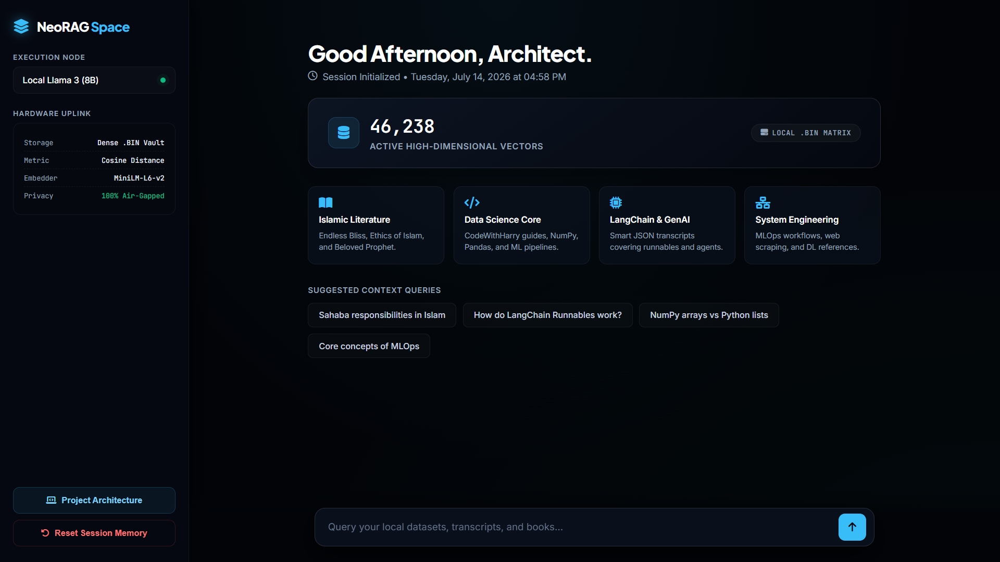
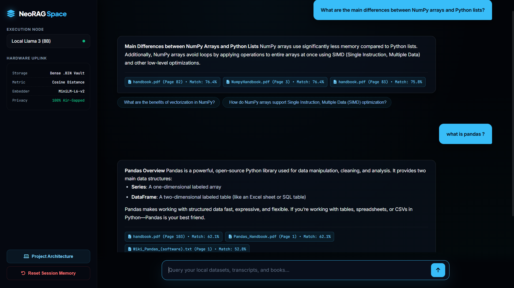
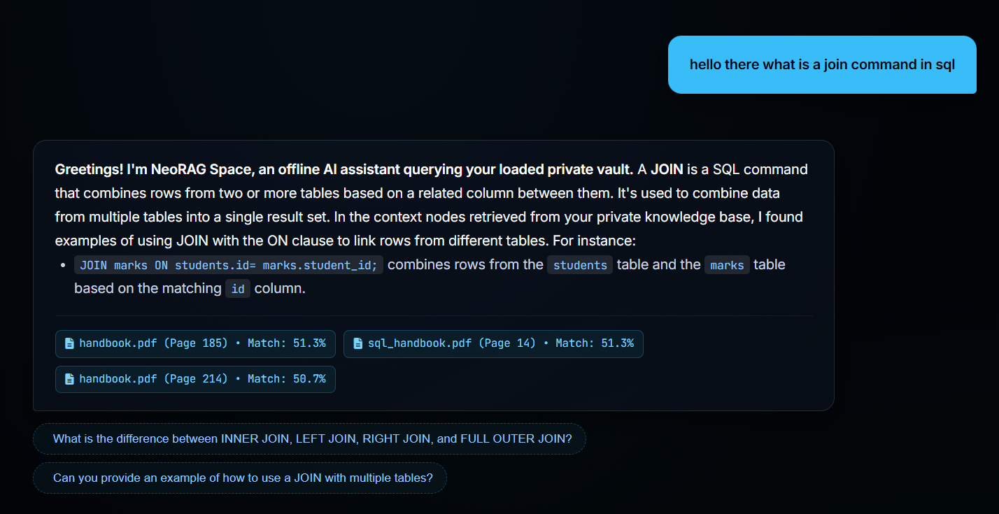
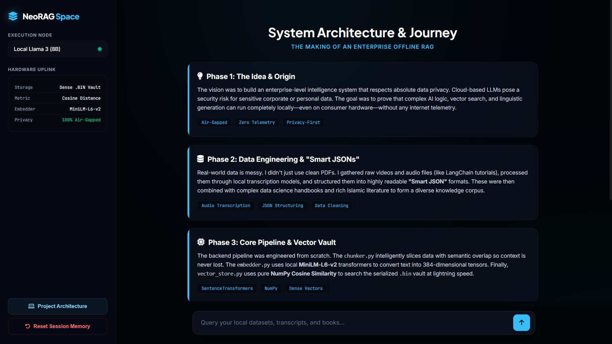

<div align="center">

  <h1 align="center">
    
    <br/>
    🌌 NeoRAG SPACE
  </h1>

  ### Enterprise Local Private Knowledge Core

  [](https://www.python.org/)
  [](https://flask.palletsprojects.com/)
  [](https://numpy.org/)
  [](https://ollama.com/)
  [](https://ollama.com/library/llama3)
  [-red?style=for-the-badge)](https://huggingface.co/sentence-transformers/all-MiniLM-L6-v2)
  [](#-security--governance-protocols)
  [](LICENSE)

  <p align="center">
    <b>NeoRAG Space</b> is a production-grade, <b>100% offline, air-gapped Retrieval-Augmented Generation (RAG) engine</b>. It parses, chunks, vectorizes, and searches private technical repositories entirely on your own machine — <b>no cloud APIs, no external telemetry, zero data leakage</b>.
  </p>

  <p align="center">
    <a href="#-system-architecture--data-pipelines"><strong>🏗️ Architecture</strong></a>
    &nbsp;•&nbsp;
    <a href="#-mathematical-foundations"><strong>📐 Math</strong></a>
    &nbsp;•&nbsp;
    <a href="#-step-by-step-local-setup--execution"><strong>⚙️ Run Locally</strong></a>
    &nbsp;•&nbsp;
    <a href="#-security--governance-protocols"><strong>🔒 Governance</strong></a>
  </p>

</div>

---

## 📑 Table of Contents

- [Executive Summary](#-executive-summary)
- [Dashboard Showcase](#-dashboard-showcase)
- [System Architecture & Data Pipelines](#-system-architecture--data-pipelines)
- [Mathematical Foundations](#-mathematical-foundations)
- [Repository Architecture & Taxonomy](#-repository-architecture--taxonomy)
- [Step-by-Step Local Setup & Execution](#-step-by-step-local-setup--execution)
- [System Performance & Optimization](#-system-performance--optimization)
- [Security & Governance Protocols](#-security--governance-protocols)
- [Author & Portfolio](#-author--portfolio)
- [License](#-license)

---

## 💡 Executive Summary

By combining decentralized Python modules with memory-cached NumPy matrix computation, NeoRAG Space extracts fact-based references from academic textbooks, software manuals, and processed multimedia transcripts, then uses them to constrain a **local** Llama 3 runtime served by Ollama. Every answer is grounded in your own corpus and ships with verifiable source attribution.

| Problem with typical RAG stacks | How NeoRAG Space handles it |
| --- | --- |
| Private documents are sent to third-party cloud APIs | **Everything runs locally** — parsing, embedding, search, and generation never leave the machine |
| Per-token API costs and vendor lock-in | Local **Ollama + Llama 3** runtime; no API keys, no metering |
| Opaque answers you cannot verify | Every response carries a **Citations Block**: source file, page boundary, and similarity match score |
| Heavy vector-database infrastructure | A single serialized **`.bin` NumPy vector vault**; no database server to run or secure |
| Boot-time timeouts while large indexes load | A **background worker primes the index into RAM** while the browser shows a live progress monitor |
| Single-format ingestion | Page-by-page **PDF**, nested **JSON video transcripts**, and raw **plain-text** logs |
| Telemetry baked into the toolchain | **Zero telemetry** by design |

**Core stack:** Python · Flask (multi-threaded async server) · NumPy (vector similarity math) · `all-MiniLM-L6-v2` (384-dim embeddings) · Ollama (Llama 3 runtime) · HTML5 / CSS3 / Vanilla JS client

---

## 🖥️ Dashboard Showcase

### 🔍 Live Inference & Response Attribution

The web client provides explainable, real-time analytics by tying local LLM generation directly to the source knowledge base through verifiable metadata attribution.

<div align="center">
  
</div>

- **Context-aware generation:** On each query, the semantic search core scans the local vector vault and extracts the high-dimensional nodes most aligned with the user's input.
- **Granular source attribution:** Each response includes an isolated **Citations Block** with the exact file origin (`handbook.pdf`), page boundary (`Page 82`), and a **Similarity Match Score** (`76.4%`).
- **Trust & transparency:** Exposed match percentages let users independently verify the relevance and factual grounding of an answer against the private corpus.
- **Real-time telemetry:** The dashboard displays live matrix statistics, such as **46,238 active vector nodes** resident in the current memory matrix.

### ⚡ Core Operational Pipelines

<div align="center">

| 🧠 Real-Time Domain Inference | 🔬 Data Science Core Pipeline |
| :---: | :---: |
|  |  |
| *Factual query extraction with dynamic follow-up prediction chips.* | *Markdown code rendering, SIMD optimization docs, and Pandas structural tracing.* |

</div>

### 🏗️ Architecture Showcase & Journey

<div align="center">
  
  <br/>
  <p><i>Interactive timeline covering project origin, data engineering, and system flow.</i></p>
</div>

---

## 🛠️ System Architecture & Data Pipelines

```text
+---------------------------------------------------------------------------------+
|                    🚀 NeoRAG Space: Architecture Flow 🚀                        |
+---------------------------------------------------------------------------------+

 [ 📄 Private Documents ] (PDF, TXT, JSON Transcripts)
          │
          ▼
 [ ⚙️ 1. Ingestion Layer ] -----------> Parses streams & tracks file metadata
          │
          ▼
 [ ✂️ 2. Semantic Chunker ] ----------> Overlapping 500-char context windows
          │
          ▼
 [ 🧠 3. Local Embedder ] ------------> all-MiniLM-L6-v2 (384-dim dense tensors)
          │
          ▼
 [ 💾 4. Vector Vault (.bin) ] -------> Binary serialized NumPy storage matrix
          │
          +-----------------------+ (User Query hits Flask Backend)
                                  │
                                  ▼
 [ 🧮 5. Similarity Search ] ---------> Dot-Product & Cosine Distance math scan
                                  │
                                  ▼
 [ 🤖 6. Ollama Local LLM ] ----------> Llama3 synthesizes factual answers locally
                                  │
                                  ▼
 [ 💻 7. Client Dashboard ] ----------> Displays Response + Citation Metrics UI
```

### Pipeline Stages

| # | Stage | Module | What it does |
| :-: | --- | --- | --- |
| 1 | **Ingestion Layer** | `src/ingestor.py` | Multi-format file streaming engine. Parses binary data streams from page-by-page PDFs, nested JSON video-transcript properties, and raw unformatted plain-text logs, while tracking file metadata for later attribution. |
| 2 | **Context-Window Chunker** | `src/chunker.py` | Sliding character-window algorithm that splits text into **500-character blocks with ~15% overlap**, so no passage is clipped at a chunk boundary. |
| 3 | **Local Embedder** | `src/embedder.py` | Loads the local transformer **`all-MiniLM-L6-v2`** directly into hardware cache and maps each chunk to a **384-dimensional** floating-point vector — with no external network calls. |
| 4 | **Persistent Vector Vault** | `src/vector_store.py` | Serializes the compiled vector payload to a high-speed binary **`.bin`** file (`vault_manager/vector_index.bin`) so the index survives restarts. |
| 5 | **Vectorized Cosine Search** | `src/vector_store.py` | Uses NumPy matrix operations to score the query vector against the full index by cosine similarity (see [Mathematical Foundations](#-mathematical-foundations)). |
| 6 | **Ollama Llama 3 Inference** | Ollama runtime | The best-matching chunks constrain a locally running **Llama 3** model, which synthesizes the grounded answer — entirely on-device. |
| — | **Async Web Portal** | `app.py` | Multi-threaded Flask server. On boot, a background worker primes the index into RAM while the browser shows a progress monitor, preventing connection timeouts. |
| — | **Dialogue Memory** | `src/memory_manager.py` | Multi-turn rolling dialogue buffer that maintains conversational state across turns. |

### Chunking Geometry

With a 500-character window and ~15% overlap, adjacent chunks share roughly 75 characters:

$$
\text{stride} \approx 500 - 75 = 425 \text{ characters}
$$

---

## 📐 Mathematical Foundations

Every chunk and every query is mapped into the same 384-dimensional vector space:

$$
\mathbf{q},\ \mathbf{v}_i \in \mathbb{R}^{384}
$$

### Dot Product

$$
\mathbf{q} \cdot \mathbf{v} = \sum_{j=1}^{384} q_j \, v_j
$$

### Euclidean (L2) Norm

$$
\lVert \mathbf{v} \rVert = \sqrt{\sum_{j=1}^{384} v_j^{2}}
$$

### Cosine Similarity

$$
\text{similarity}(\mathbf{q}, \mathbf{v}) = \cos\theta = \frac{\mathbf{q} \cdot \mathbf{v}}{\lVert \mathbf{q} \rVert \, \lVert \mathbf{v} \rVert}
$$

| Symbol | Meaning |
| :-: | --- |
| $\mathbf{q}$ | Embedding of the user query (384 floats) |
| $\mathbf{v}$ | Embedding of one stored document chunk (384 floats) |
| $\mathbf{q} \cdot \mathbf{v}$ | Dot product of the two vectors |
| $\lVert \mathbf{q} \rVert,\ \lVert \mathbf{v} \rVert$ | L2 norms (vector magnitudes) |
| $\theta$ | Angle between the vectors in embedding space |

The score ranges from $-1$ to $1$; values closer to $1$ mean the chunk is semantically closer to the query. **Cosine distance** is the complement, $1 - \cos\theta$. The dashboard presents the score as a percentage (for example, `76.4%`).

### Why it is fast: one matrix product

Instead of looping over chunks, the whole index is held as a matrix $\mathbf{M} \in \mathbb{R}^{N \times 384}$ ($N$ = number of chunks, e.g. 46,238) and scored in one vectorized NumPy operation:

$$
\mathbf{s} = \frac{\mathbf{M}\,\mathbf{q}}{\lVert \mathbf{M}_{i} \rVert \, \lVert \mathbf{q} \rVert}
$$

When vectors are L2-normalized, the denominator equals 1 and cosine similarity reduces to a plain dot product, $\mathbf{s} = \mathbf{M}\mathbf{q}$. The highest-scoring chunks are then selected as the context handed to the LLM.

---

## 🗂️ Repository Architecture & Taxonomy

```text
neorag-space/
├── assets/                       # Dashboard screenshots and branding
│   ├── demo_21.png               # Data science workflow + Markdown rendering demo
│   ├── neo_rag_response_demo.png # Live inference + citation attribution screenshot
│   ├── NeoRAG_Architecture.png   # Project showcase (PPT view) capture
│   ├── NeoRAG_Look.png           # Main workspace + vector matrix dashboard view
│   └── NeoRAG_Space_Logo.ico     # Custom platform branding icon
├── Knowledge_Source/             # Local document library (PDFs, textbooks, text files)
├── smart_jsons/                  # Extracted multimedia transcript datasets (JSON)
├── src/                          # Modular, object-oriented core logic
│   ├── chunker.py                # Sliding-window text segmentation
│   ├── embedder.py               # all-MiniLM-L6-v2 text → 384-dim vector conversion
│   ├── ingestor.py               # Multi-format document parsing pipeline
│   ├── memory_manager.py         # Multi-turn rolling dialogue buffer
│   └── vector_store.py           # Binary persistence + NumPy similarity search
├── templates/
│   └── index.html                # Asynchronous client dashboard template
├── vault_manager/
│   └── vector_index.bin          # Serialized vector index (generated; git-ignored)
├── app.py                        # Multi-threaded Flask orchestration server
├── download_model.py             # Caches the embedding model for offline use
├── main_pipeline.py              # Index builder: ingest → chunk → embed → serialize
├── query_engine.py               # Standalone interactive terminal query shell
├── requirements.txt              # Python dependency specification
└── .venv/                        # Isolated virtual environment (git-ignored)
```

---

## 🚀 Step-by-Step Local Setup & Execution

> **NeoRAG Space is a local-only engine.** There is no cloud deployment path — it is designed to run on a single machine and be reached on `localhost`.

### Prerequisites

- **Python 3** with `pip` (use the version your `requirements.txt` targets)
- **[Ollama](https://ollama.com/)** installed on the host
- Enough RAM to hold the in-memory vector index and the Llama 3 model alongside each other
- **One-time network access** to install Python packages and fetch model weights (the embedding model and Llama 3). After this one-time provisioning, the runtime requires no network at all.

### 1. Enter the project root

```bash
cd neorag-space
```

### 2. Create and activate the virtual environment

```bash
python -m venv .venv
```

```bash
# Windows
.venv\Scripts\activate

# Linux / macOS
source .venv/bin/activate
```

### 3. Install dependencies

```bash
pip install -r requirements.txt
```

### 4. Cache the embedding model (one-time)

Skip this step if the model is already cached locally.

```bash
python download_model.py
```

### 5. Start the Ollama runtime and pull Llama 3

In a **separate terminal**:

```bash
ollama serve
```

Then pull the model once:

```bash
ollama pull llama3
```

> If the Ollama desktop app is already running, the server is already up and `ollama serve` may report that the port is in use — that is fine, continue to the next step.

### 6. Add your documents

Place source material in the knowledge directories:

- `Knowledge_Source/` — PDFs, textbooks, plain-text materials
- `smart_jsons/` — extracted multimedia transcript JSON files

### 7. Build the vector vault

```bash
python main_pipeline.py
```

This runs the ingest → chunk → embed → serialize pipeline and writes `vault_manager/vector_index.bin`.

### 8. Launch the web application

```bash
python app.py
```

On Windows you can alternatively double-click the `NeoRAG_Space.bat` desktop launcher.

### 9. Open the dashboard

Open **http://127.0.0.1:5000** (equivalently **http://localhost:5000**) in a browser **on the same machine that is running the server**.

- The server listens on the loopback interface, so the dashboard is reachable only from the host machine itself.
- If port `5000` is already taken, change the port in `app.py` and use that port in the URL.
- On first boot, a progress monitor is shown while the background worker loads the index into RAM; the interface becomes interactive once priming completes.

### Optional: terminal query shell

```bash
python query_engine.py
```

---

## 📊 System Performance & Optimization

| **Component** | **Description** | **Optimization Strategy** |
| :--- | :--- | :--- |
| **Chunker** | Sliding semantic-window segmentation | ~15% overlap ratio preserves structural boundaries across chunks |
| **Embedder** | `all-MiniLM-L6-v2` transformer, 384-dim output | Runs locally from hardware cache with no network calls; batch embedding |
| **Vector Store** | Binary serialization of dense tensors | Compiled `.bin` index; background worker primes it into RAM at boot |
| **Search Layer** | NumPy cosine similarity | Vectorized dot-product computation over the full index matrix |
| **Inference** | Flask server + Ollama local engine | Asynchronous background multithreading keeps the UI responsive |

---

## 🔒 Security & Governance Protocols

- **100% air-gapped execution:** At runtime there is zero external network dependency and no cloud API calls. All computation happens inside the local workspace.
- **Zero telemetry:** No usage data, queries, or documents are reported anywhere.
- **Data privacy assurance:** Private PDFs, audio transcripts, and plain-text logs stay inside the local repository boundary.
- **Loopback-only serving:** The dashboard is served on `127.0.0.1`. Exposing it on a network interface is a deliberate departure from the default security posture.
- **Integrity validation:** The vector payload undergoes matrix-structure bounds checking before persistent binary serialization.
- **Exclusion governance:** Heavy indices and virtual-environment dependencies are kept out of version control via strict `.gitignore` boundaries.

---

## 👨‍💻 Author & Portfolio

<div align="center">

**Md Salik Ubair — Full-Stack AI Engineer**
B.Tech CSE (AI/ML)

[](https://portfolio-salik-live.vercel.app)
[](https://github.com/Md-Salik-Ubair)

</div>

This system was solo-architected and developed from the ground up as an Enterprise Data Privacy & AI/ML portfolio module, focused on localized mathematical computation, multi-format data engineering, and standalone software execution.

---

## 📄 License

Distributed under the **MIT License**. See [`LICENSE`](LICENSE) for details.

<div align="center">

*Engineered for Zero Telemetry, Complete Data Privacy, and Standalone Edge Intelligence (2026).*

</div>